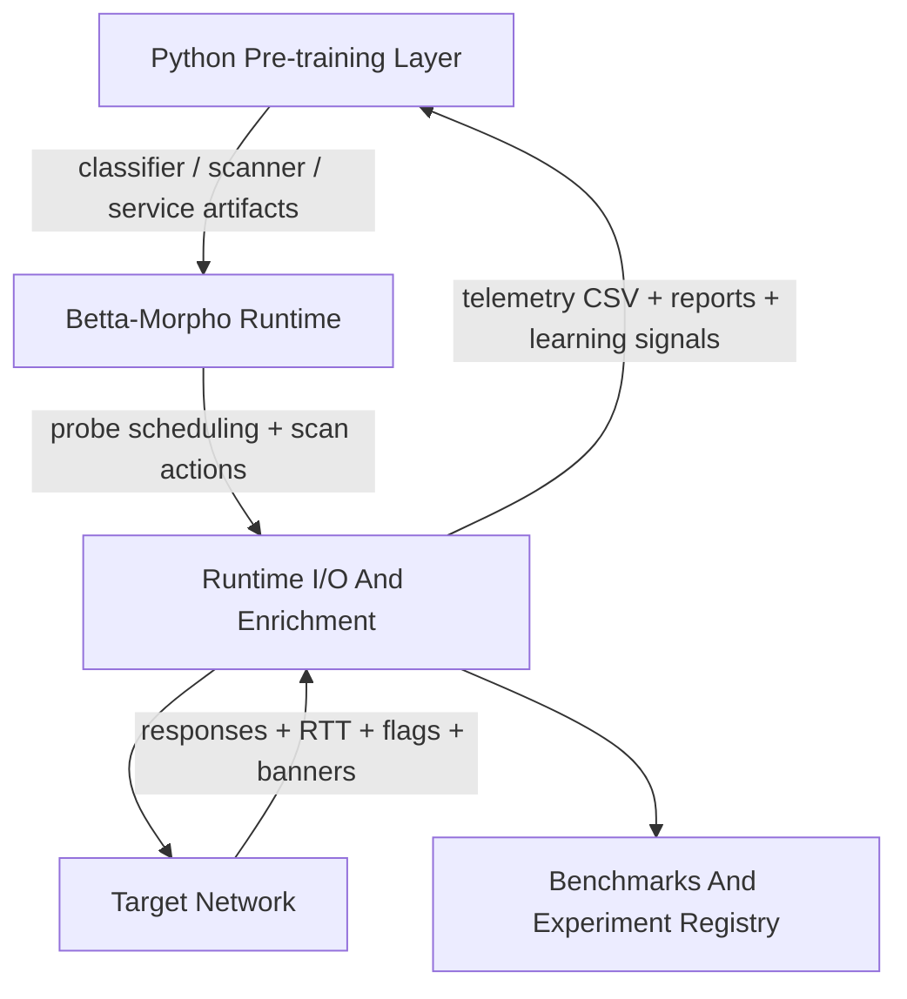

# Betta-Morpho

Betta-Morpho is a research-grade neuromorphic scanner and telemetry platform.
The project combines:

- SNN-driven scanning logic
- telemetry export and classifier training
- enrichment and service fingerprinting
- report generation and Nmap verification
- benchmark and experiment tracking

The repository has grown into a platform, so this `README` is now the short
entry point. Detailed usage is split into focused guides under `docs/`.

> Scope: authorized security testing, HTB/CTF labs, local validation, and defensive research.

Current release: `2.3.3`

## Architecture At A Glance



Main idea:

- Python builds and evaluates model artifacts
- Betta-Morpho runtime uses those artifacts during scanning
- scan results feed reports, verification, replay, and later retraining
- benchmark and registry tooling track what changed between runs

## Quick Start

### Windows

```powershell
python -m venv .venv
.\.venv\Scripts\python.exe -m pip install -e .
.\.venv\Scripts\python.exe -m pip install pyright
python launcher.py
```

### Linux

```bash
python3 -m venv .venv
.venv/bin/pip install -e .
.venv/bin/pip install pyright

# optional raw mode capability
sudo setcap cap_net_raw+eip .venv/bin/python3

python launcher.py
```

## Most Common Commands

Train a classifier:

```bash
python training/train.py \
  --data data/synthetic_dataset.csv \
  --artifact artifacts/snn_model.json
```

Train a scanner strategy artifact:

```bash
python launcher.py scan-train \
  --profile normal \
  --artifact artifacts/scanner_model.json
```

Run a practical scan:

```bash
python launcher.py scan \
  --target 127.0.0.1 \
  --ports top20 \
  --profile x15 \
  --transport connect \
  --report artifacts/snn_model.json
```

Run a larger scan with checkpoints:

```bash
python launcher.py scan \
  --target 10.129.41.202 \
  --ports 1-5000 \
  --profile x10 \
  --checkpoint-every 1000 \
  --report artifacts/snn_model.json
```

Verify Betta-Morpho findings with Nmap:

```bash
python launcher.py verify-betta-morpho \
  --scan-csv data/scans/SESSION/SESSION_result.csv
```

Compare two scan runs:

```bash
python launcher.py benchmark-scans \
  --baseline-csv data/scans/A/A_result.csv \
  --candidate-csv data/scans/B/B_result.csv \
  --register
```

Open the guided menu:

```bash
python launcher.py wizard
```

## Documentation Map

Start here, then go deeper only where needed:

- [docs/QUICKSTART.md](docs/QUICKSTART.md)  
  Short onboarding for Windows, Linux, training, and first scan runs.
- [docs/SCANNING_GUIDE.md](docs/SCANNING_GUIDE.md)  
  Scan modes, speed profiles, checkpoints, raw vs connect, stealth, verification.
- [docs/TRAINING_GUIDE.md](docs/TRAINING_GUIDE.md)  
  Synthetic data, real data, classifier training, replay, evaluation.
- [docs/CLI_REFERENCE.md](docs/CLI_REFERENCE.md)  
  Launcher, scanner, service-model, benchmark, and registry commands.
- [docs/ARCHITECTURE.md](docs/ARCHITECTURE.md)  
  High-level architecture, artifact families, SNN model summary, data schema.

Related repository documents:

- [docs/Engineering_Draft.md](docs/Engineering_Draft.md)  
  Deeper engineering vision and architecture direction.
- [docs/SCAN_SPEED_THEORY_EN.md](docs/SCAN_SPEED_THEORY_EN.md)  
  Throughput, scan pressure, and speed-mode reasoning.
- [ROADMAP.md](ROADMAP.md)  
  Planned features and research directions.
- [docs/IMPLEMENTATION_IDEAS_EN.md](docs/IMPLEMENTATION_IDEAS_EN.md)  
  Current implementation status and next leverage points.

## Repository Layout

Top-level structure:

```text
Betta-Morpho/
|-- launcher.py
|-- training/
|-- tools/
|-- artifacts/
|-- data/
|-- docs/
|-- rust-runtime/
|-- LICENSE
|-- NOTICE
|-- DISCLAIMER.md
|-- AUTHORIZED_USE_POLICY.md
|-- TRADEMARKS.md
|-- CONTRIBUTING.md
`-- DCO
```

Main runtime areas:

- `launcher.py`  
  Universal entry point and interactive wizard.
- `training/`  
  Classifier training, evaluation, replay, synthetic data generation.
- `training/tools/scanner.py`  
  Main Python scanner facade.
- `tools/`  
  Verification, service fingerprinting, catalog building, benchmarks, registry, lab utilities.
- `rust-runtime/`  
  Rust scanner/runtime and replay components.

## Legal and Safe Use

Betta-Morpho is licensed under Apache-2.0.

Read these files before operational use:

- [LICENSE](LICENSE)
- [NOTICE](NOTICE)
- [DISCLAIMER.md](DISCLAIMER.md)
- [AUTHORIZED_USE_POLICY.md](AUTHORIZED_USE_POLICY.md)
- [SECURITY.md](SECURITY.md)
- [TRADEMARKS.md](TRADEMARKS.md)
- [CONTRIBUTING.md](CONTRIBUTING.md)
- [DCO](DCO)

Important practical points:

- use the project only where you are authorized
- the code is open, but the Betta-Morpho name and branding are not automatically granted for reuse
- contributors should sign commits with `git commit -s`

## Quality Checks

Static analysis:

```bash
# Windows
.\.venv\Scripts\pyright.exe

# Linux
.venv/bin/pyright
```

Current project target: clean `pyright`.

## Autonomous Environment

Bootstrap the local autonomous environment:

```bash
chmod +x scripts/bootstrap-autonomous.sh
./scripts/bootstrap-autonomous.sh
```

Start the default autonomous scan flow from `.env`:

```bash
chmod +x scripts/start-autonomous.sh
./scripts/start-autonomous.sh
```

Windows equivalents:

```powershell
powershell -ExecutionPolicy Bypass -File .\scripts\bootstrap-autonomous.ps1
powershell -ExecutionPolicy Bypass -File .\scripts\start-autonomous.ps1
```

Common test runs:

```bash
python -m unittest tools.test_launcher_smoke
python -m unittest tools.test_scanner_telemetry
python -m unittest tools.test_service_fingerprint
python tools/test_decoys.py --port 19801
```

## Why The Docs Were Split

The old `README` had turned into a full manual. That was useful as a knowledge
base, but too heavy as a start page. The new structure keeps:

- a short root overview
- separate guides for scanning, training, CLI usage, and architecture
- legal and safety files as first-class project documents

That should make the project much easier to onboard, navigate, and maintain.
