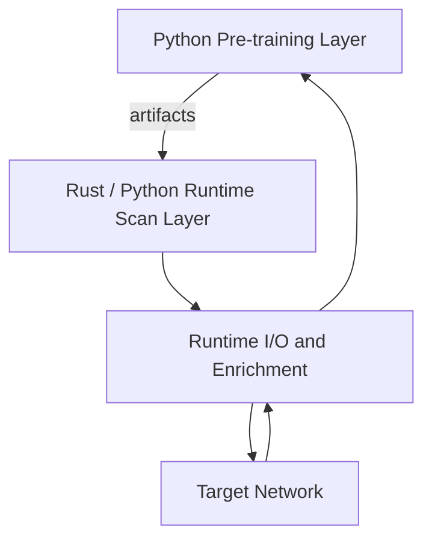

# Architecture

This guide gives the high-level shape of Betta-Morpho without turning into the full engineering draft.

## Core Idea

Betta-Morpho is not just a wrapper around a traditional scanner.
The project treats scanning as a neuromorphic control problem:

- the scanner strategy is represented by an SNN artifact
- probe pacing and action choice are influenced by SNN state
- telemetry can be exported back into training and analysis pipelines

## Main Runtime Layers

## Artifact Families

### Classifier Artifact

Purpose:

- classify telemetry rows as `normal`, `delayed`, or `filtered`

Typical path:

- `artifacts/snn_model.json`

### Scanner Strategy Artifact

Purpose:

- influence scan action selection and pacing

Typical path:

- `artifacts/scanner_model.json`

### Service Fingerprint Artifact

Purpose:

- predict service labels from banners and enrichment fields

Typical path:

- `artifacts/service_model.json`

### Service Catalog Artifact

Purpose:

- normalize service names, versions, and CPE hints using local Nmap-derived data

Typical path:

- `artifacts/service_catalog.json`

### Passive Host Discovery Artifact

Purpose:

- rank hostnames and domains extracted passively from existing scan evidence

Typical path:

- `artifacts/host_discovery_model.json`

### Benchmark Manifest

Purpose:

- compare two scan runs and track overlap, recall, precision, service agreement, and elapsed time

Typical path:

- `data/benchmarks/*.json`

## Data Flow

Typical workflow:

1. generate or collect telemetry
2. train classifier or scanner artifacts
3. run scan
4. enrich services and export reports
5. optionally extract and rank passive hostname/domain candidates
6. optionally verify with Nmap
7. compare runs with benchmarks
8. register results in the experiment registry

## Data Schema

Main CSV fields:

- `timestamp_us`
- `asset_ip`
- `target_port`
- `protocol_flag`
- `inter_packet_time_us`
- `payload_size`
- `rtt_us`
- `label`
- `os_hint`
- `banner`
- `service`
- `service_version`
- `technology`
- `cpe`
- `cve_hint`
- `service_prediction`
- `service_confidence`
- `response_entropy`
- `tcp_window`
- `scan_note`

Classifier training mainly uses the original telemetry fields.
Enrichment fields are most useful for reports, service modeling, and later research loops.

Additional passive-host-discovery outputs:

- `*_hostnames.csv`
- `*_hostnames_report.html`

## Profiles And Speeds

Profile families:

- stealth-oriented: `paranoid`, `sneaky`, `polite`
- general use: `normal`
- high-speed: `aggressive`, `x5`, `x10`, `x15`
- manual override: `--speed-level 1..100`

## Registry And Benchmark Layer

The project now includes:

- artifact schema validation
- benchmark manifests
- experiment registry in SQLite
- domain-level summaries for `synthetic`, `verified_real`, and `replay`

## Where The Deeper Detail Lives

For full design direction and deeper rationale:

- [Engineering_Draft.md](Engineering_Draft.md)
- [SCAN_SPEED_THEORY_EN.md](SCAN_SPEED_THEORY_EN.md)
- [../ROADMAP.md](../ROADMAP.md)
